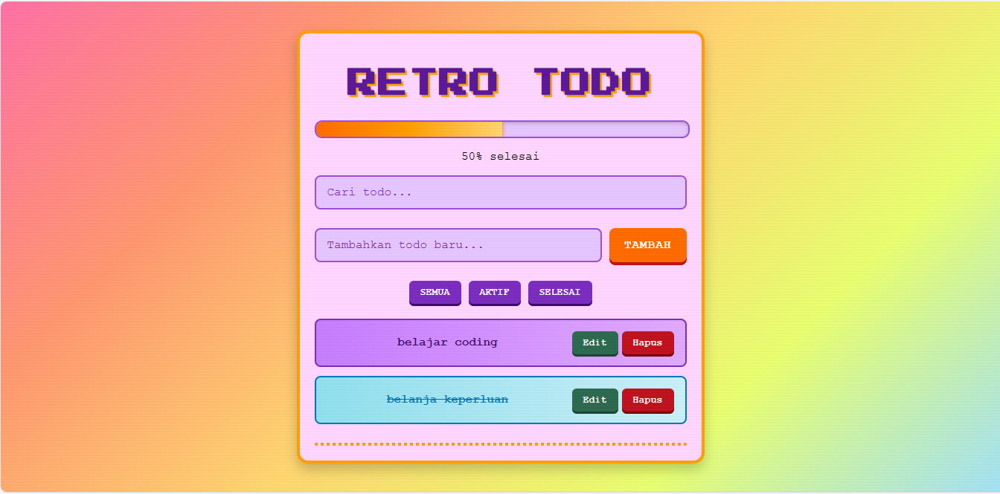

# 🕹️ Retro Todo List (React)

  
  
  


✨ Aplikasi **Todo List** dengan sentuhan **retro 8-bit**! Dibuat menggunakan **React** dengan desain colorful, animasi retro, dan efek suara klasik.  

---

## 🚀 Fitur Utama
- ✅ Tambah, hapus, edit todo dengan mudah  
- 🔍 Cari todo dengan fitur pencarian real-time  
- 🎛️ Filter todo: **Semua | Aktif | Selesai**  
- 📊 Progress bar animasi (menunjukkan progress penyelesaian)  
- 🖊️ Edit todo langsung dan simpan dengan tombol **Enter**  
- 🎶 Efek suara retro (klik & popup)  
- 📱 Responsive design (cocok di mobile & desktop)  
- 🕹️ UI dengan gaya **retro pixel-art vibes**  

---

## 📸 Preview

  
*(Contoh screenshot aplikasi Retro Todo)*

---

## 📂 Struktur Folder
```bash
src/
 ├─ components/
 │   ├─ TodoList.js       # Komponen utama
 │   ├─ TodoItem.js       # Item todo
 │   ├─ AddTodo.js        # Input & tombol tambah
 │   ├─ SearchBar.js      # Pencarian
 │   ├─ FilterButtons.js  # Tombol filter
 │   ├─ ProgressBar.js    # Progress bar
 │   ├─ ConfirmPopup.js   # Popup konfirmasi
 │   └─ TodoList.css      # Styling retro todo
 ├─ App.js
 ├─ App.css
 └─ index.js
```

---

## ⚡ Instalasi & Penggunaan

1. Clone repository ini:
   ```bash
   git clone https://github.com/usamahdhaqi/todo-app.git
   cd todo-app
   ```

2. Install dependencies:
   ```bash
   npm install
   ```

3. Jalankan project:
   ```bash
   npm start
   ```

4. Buka di browser:  
   👉 [http://localhost:3000](http://localhost:3000)

---

## 🎮 Kontrol Utama
- **Enter** → Tambahkan todo baru / simpan edit  
- **Klik teks todo** → Tandai selesai / aktif  
- **Edit** → Edit todo  
- **Hapus** → Muncul popup konfirmasi  

---

## 🛠️ Teknologi yang Digunakan
- [React](https://react.dev/)  
- HTML5, CSS3 (Retro Style)  
- LocalStorage (penyimpanan todo)  
- Custom Sound Effects (CC0 License)  

---

## 📝 Lisensi
Proyek ini menggunakan lisensi **MIT**.  
Silakan digunakan, diubah, dan dikembangkan sesuai kebutuhan ✨  

---

### 💡 Catatan
- Folder `/public/sounds` digunakan untuk menyimpan efek suara retro (`click.wav`, `popup.wav`).  

---

🎉 Selamat menggunakan **Retro Todo List** dan rasakan nuansa nostalgia 8-bit setiap kali kamu mengelola tugas harianmu!
